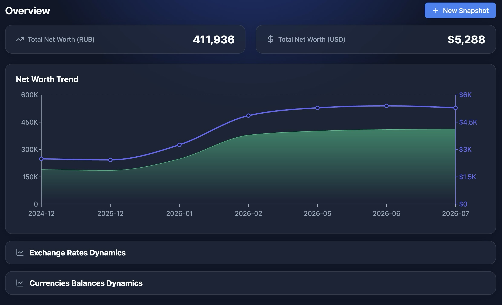
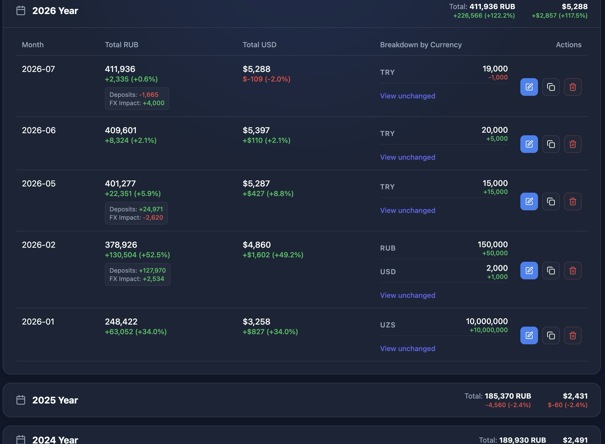

# Usage Guide

## Getting started

* **Choose your currencies:** Configure your base currency before adding the first historical snapshot so Finn can correctly store and lock historical exchange rates.
* **Add a snapshot:** Select **New Snapshot**. You can copy balances from the previous month, and Finn saves an in-progress draft in the background.
* **Isolate chart series:** Double-click an item in a chart legend to isolate an organization, currency, or asset tag. Single-click it to toggle visibility.
* **Use Cash Flow only if you need it:** The journal is disabled by default and is not required for snapshot-based net worth tracking. See the [Cash Flow guide](cash-flow.md) if you want to record movements.

## Screenshots

### Overview

### History and advanced analytics

[Back to the README](../README.md)
